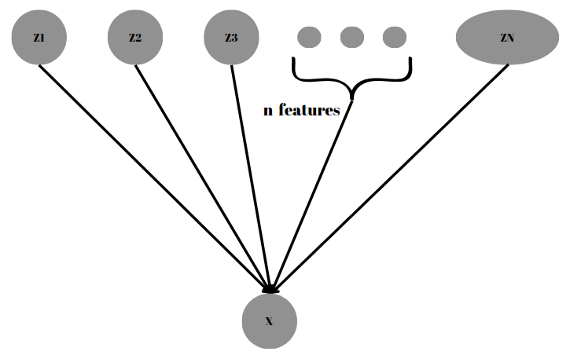
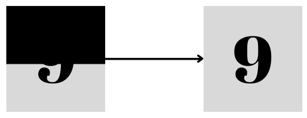
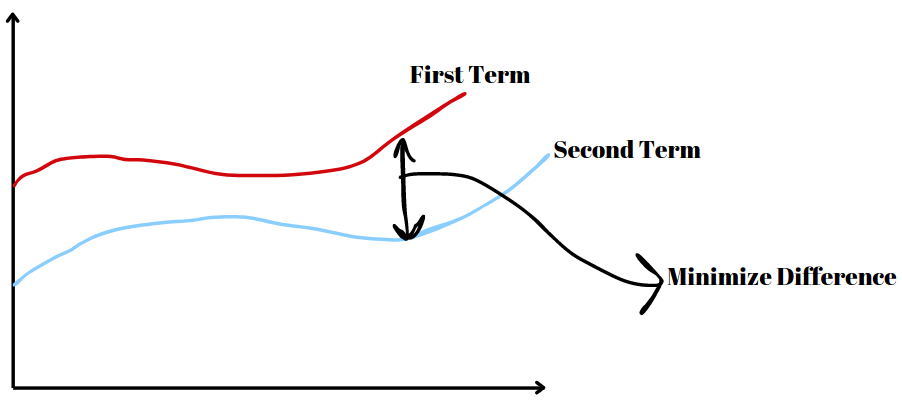

# Latent Variable Models & Variational Inference
Topic Summary for CENG796 by Enes Şanlı &amp; Hamza Etcibaşı

## 1. Introduction and Motivation
- **What are Latent Variable Models (LVMs)?**
Latent Variable Models (LVMs) are statistical models that include variables that are not directly observed but are inferred from other variables that are observed (measured). These unobserved variables are termed "latent variables." LVMs are used to model complex phenomena where the observed data is believed to be generated from underlying factors that are not directly measurable.  
In terms of a mathematical explanation, Latent Variable Models aim to obtain the observed data $X$ by utilizing the latent variables $Z$. This is because directly finding $P(X)$ is more challenging compared to finding $P(X∣Z)$. Hence, LVMs generally exploit the following equality: $P(X)=P(X∣Z)⋅P(Z)$

- **Importance and Applications in Machine Learning and Statistics**
LVMs play a crucial role in various fields within machine learning and statistics due to their ability to model complex and high-dimensional data in a more interpretable and compact form. Some key applications include:
    - **Dimensionality Reduction:** Techniques like PCA reduce the number of variables under consideration, making the data easier to visualize and analyze while retaining its essential properties.
    - **Data Imputation:** LVMs can be used to estimate missing values in datasets by leveraging the relationships between observed and latent variables.
    - **Clustering:** Models like GMMs are used for identifying subgroups within data by assuming that data points belong to different latent clusters.
    - **Time Series Analysis:** HMMs and other sequential LVMs are essential for modeling and predicting time-dependent phenomena in fields like speech recognition, finance, and bioinformatics.
    - **Topic Modeling:** LDA is widely used in natural language processing to uncover the hidden thematic structure in large text corpora.
 
- **Motivation Behind Using Latent Variable Models**
  

Like in Fig 1. suppose we want to generate an image of a dog. We know that dogs have certain features, such as color, breed, and size. However, can we limit these features? Or can we identify every feature for each image? The answer to this question is, of course, no. A single image can have an infinite number of latent features, and it is impossible for us to identify all of them accurately. However, if we can learn the most important of these features, we can use them to generate images much more easily. This is because estimating probability distributions based on an image's features is much easier than estimating from a complete probability distribution. This logic is the motivation behind Latent Variable Models. 
## 2. Types of Latent Variables
#### 2.1 Mixture of Gaussians: A Shallow Latent Variable Model

The Mixture of Gaussians (MoG) model is a probabilistic model that assumes data points are generated from a mixture of several Gaussian distributions. Each Gaussian distribution represents a cluster or component within the overall data distribution. This model is often used for clustering and density estimation.

In a Mixture of Gaussians model, we have a latent variable \(z\) that determines which Gaussian component a data point belongs to. The generative process can be represented as a simple Bayesian network: z → x 

Here:
- \(z\) is the latent variable.
- \(x\) is the observed data.
  

#### Generative Process

1. **Select a Gaussian component:**
   - Sample **z** from a categorical distribution with **k** components.
   

        $z \sim \text{Categorical}(1, \ldots, k)$
   

2. **Generate a data point:**
   - Given **z = k**, sample **x** from the corresponding Gaussian distribution.
   

        $p(x \mid z = k) = \mathcal{N}(x \mid \mu_k, \Sigma_k)$
   

By following these steps, the Mixture of Gaussians model generates data points that can represent complex, multimodal distributions through the combination of multiple Gaussian components.

- **Use Cases and Advantages of MoG in Modeling Data Distributions**

#### 2.2 Variational Autoencoders (VAEs)
- **Explanation of VAEs as a Generative Model**
- **Difference Between Deterministic and Stochastic Latent Representations**

## 3. Inference and Marginal Probability
Suppose we are working with an image during the training phase where the pixel values in the upper half are missing, and our goal is to reconstruct the original image. Let $X$ be our observed random variables, and $Z$ be our unobserved random variables. We have a joint model that utilizes these $Z$. We can express this model as $P(X,Z;θ)$, where $X$ represents the observed variables, $Z$ represents the unobserved random variables, and $θ$ denotes the weights of our model.  

Can we determine the value of $P(X=x;θ)$ in this manner?  
Mathematically, yes, we can. However, the process to find this can be expressed as follows: $\sum_{z}P(X=x,Z=z;θ)$, meaning we need to perform this operation for all possible values of $Z$. While this is theoretically possible, it is practically infeasible. This is because, even for a binary image, there are $2^Z$ possible states.

#### 3.1 Marginal Likelihood
- **Importance of Marginal Likelihood in Variational Probabilistic Modeling**  
Can we solve this problem using Maximum Log-Likelihood?  
Suppose we have a dataset $D$ where for each datapoint our $X$ variables (pixel values) are observed and $Z$ variables are unobserved (e.g., class, etc.).  
Our maximum log-likelihood is given by:

$\log \prod_{D} P(x;θ)$

which we can express using latent variables as:

$\log \prod_{D} P(x;θ) = \sum_{D} \log P(x;θ) = \sum_{D} \log \sum_{z} P(x,z;θ)$

Is it possible to compute this?

For instance, if we have $Z$ latent features, even if each of them is binary, there are $2^Z$ possible states, making this computation intractable and preventing us from calculating the gradients. This is because the number of possible states grows exponentially with the number of latent features. To solve this, we need to use an **approximation**.

#### 3.2 Sampling Techniques
- **Overview of Monte Carlo Methods for Estimating Marginal Probabilities:**
  - Naive Monte Carlo
 
As mentioned in the previous section, we need to make an approximation. This approximation will make our formula tractable. Specifically, we will use the Naive Monte Carlo method to make this      formula tractable. Let's rewrite $p(x)$. We have:

$P_{θ}(x) = \sum_{z} p_{θ}(x,z) = |Z|\sum_{z} \frac{1}{|Z|}p_{θ}(x,z) = |Z| E_{z \sim Uniform(z)}[p_{θ}(x,z)]$

Thus, we have transformed our model into an expectation. However, this expectation is still intractable. To address this, we will use the Naive Monte Carlo method. Our assumption is that these latent features are uniformly distributed. By sampling, we will find an average expectation, i.e.,

$\sum_{z} p_{θ}(x,z) = |Z| \frac{1}{k} \sum_{j=1} p_{θ}(x,z_j)$

In this way, we have made our model tractable. But does this approach serve our purpose?

Of course, No, because for most $Z$, $p_{θ}(x,z)$ is very low. So, most of Z states don't make sense. Some are very large but when we sampling the probabilty of hitting this state is very low.  
For example, suppose we want to generate an image of a girl. Some of our latent features might be hair color and eye color. However, there are many possible colors, and it is highly improbable for a girl to have both red eyes and red hair. In contrast, it is more likely for a girl to have brown hair and brown eyes. In our approximation, these two probabilities are treated as equal, which is not very realistic. Now, assume we sampling features and getting equation like that :

$\sum_{z} p_{θ}(x,z) =  p_{θ}(x,red hair , red eyes) +  p_{θ}(x, red hair , purple eyes) +  p_{θ}(x,red hair, white eyes) + ... +  p_{θ}(x,white hair, orange eyes) $

In the sampling mentioned above, for instance, the probability of nearly all terms is close to zero, indicating that we have failed to capture important latent features. This is the reason why this approximation, while theoretically sound, does not work in practice.

So we need to clever way to select $Z_j$.
  - Importance Sampling

Now let's try another way, remember our equation: $p_{θ}(x) = \sum_{z} p_{θ}(x,z)$  
We can add some terms to this equation with preserving the equation, so introduce this term: $\frac{q(z)}{q(z)}$  
Then our equation will be: $p_{θ}(x) = \sum_{z} p_{θ}(x,z) = \sum_{z} \frac{q(z)}{q(z)} p_{θ}(x,z)$  
Now, we can convert this equation to an expected value term: $\sum_{z} \frac{q(z)}{q(z)} p_{θ}(x,z) = E_{z \sim q(z)}[\frac{p_{θ}(x,z)}{q(z)}]$  
But, why we do that?  
The main intution is that, in previous sections we select $Z$ terms from Uniform sampling, but now we sampling $Z$ from $q(z)$. In this way, our $q(z)$ behaves like frequency term. And our $q(z)$ can be anything. For all $q(z)$ the equation holds.  
Now, we use again Naive Monte Carlo, the equation will be like that:

$p_{θ}(x) =  \frac{1}{k} \sum_{j=1}\frac{p_{θ}(x,z^{j})}{q(z^{j})}$

Finally we have a method for clever selecting z (latent variables), but what should be $q(z)$? The answer is in the upcoming section.

#### 3.3 Evidence Lower Bound (ELBO)
- **Introduction to ELBO as an Objective Function in VAEs**
  
Now, let's take log of previous equation

  $\log (\sum_{z} p(x,z)) = \log (\sum_{z} \frac{q(z)}{q(z)} p_{θ}(x,z)) = \log (E_{z \sim q(z)}[\frac{p_{θ}(x,z)}{q(z)}])$  

With this, we now have an additional feature. We know that the logarithm is a concave function, which means it satisfies Jensen's Inequality. What does this imply and how can we use it?

First, let's recall Jensen's Inequality. For concave functions, 

$\log ( t*x_1 + (1-t)*x_2) \geq t* \log (x_1) + (1-t)* \log (x_2)$

Now, let's apply this to our equation.

$\log (E_{z \sim q(z)}[f(z)]) = \log (\sum_{z} q(z)f(z)) \geq \sum_{z} q(z) \log(f(z))$

Now, how can we use this?

Let put $f(z) = \frac{p_{θ}(x,z)}{q(z)}$, then the equation will be:

$\log (E_{z \sim q(z)}[\frac{p_{θ}(x,z)}{q(z)}])  \geq (E_{z \sim q(z)}[\log (\frac{p_{θ}(x,z)}{q(z)})]$

 When we look this equation, the first term will not change, it is always equals to $p_{θ}(x,z)$, the value of $q(z)$ is not important, it will not change anything. And we know that finding first term is not tractable, so instead of that if we try to maximize second term we can approximate the first term. Because it likes constant.
 

Like in this figure, we try to maximize second term, and because of first term behaves like a constant we can minimize the difference between actual $p_{θ}(x,z)$ and approximated $p_{θ}(x,z)$

So, we can simply say that this second term our lower bound, and from now on, we will refer to this term as ELBO (Evidence Lower Bound).

Now, let's rewrite the equation for simplicity:

$\log (p(x))  \geq \sum_{z} q(z) \log (\frac{p_{θ}(x,z)}{q(z)}) $

$\log (p(x))  \geq \sum_{z} q(z) \log (p_{θ}(x,z)) - q(z) \log (q(z))$

$H(q) =  - q(z) \log (q(z))$

$\log (p(x))  \geq \sum_{z} q(z) \log (p_{θ}(x,z)) - q(z) \log (q(z))$

- **ELBO’s Role in Variational Inference and Model Training**
As mentioned previous sections, equation holds for all $q(z)$ terms. So let's choose $q = p(z|x;θ)$. Because it makes sense: Sample the most "explanatory" z values.

Also using this terms give us equality instead of greater equal. Let's look at the equation with $q = p(z|x;θ)$ term.

$\sum_{z} q(z) \log (\frac{p(x,z;θ)}{q(z)}) = \sum_{z} p(z|x;θ) \log (\frac{p(x,z;θ)}{ p(z|x;θ)}) $

$\sum_{z} p(z|x;θ) \log (\frac{p(x,z;θ)}{ p(z|x;θ)}) = \sum_{z} p(z|x;θ) \log (\frac{ p(z|x;θ) * p(x;θ) }{ p(z|x;θ)}) $

$\sum_{z} p(z|x;θ) \log (\frac{ p(z|x;θ) * p(x;θ) }{ p(z|x;θ)}) = \sum_{z} p(z|x;θ) \log (p(x;θ))  $

$\sum_{z} p(z|x;θ) \log (p(x;θ)) =  \log (p(x;θ)) \sum_{z} p(z|x;θ)  $

$\log (p(x;θ)) \sum_{z} p(z|x;θ) = \log (p(x;θ))$

So, the best $q(z)$ is $p(z|x;θ)$, but what happens if we choose different $q(z)$, can we measure how bad this $q(z)$ ?

The answer is:

$KL[q(z) || p(z|x)]$

$= E_{q}[ \log (q(z))] - E_{q}[\log (p(z|x))]$

$= -H[q] - E_{q}[\log (\frac{p(x,z)}{p(x)})]$

$= E_{q}[\log (p(x))] -  E_{q}[\log (p(x,z))] -H[q]$

$= \log (p(x)) -  ELBO$

$\log (p(x)) = ELBO + KL[q(z) || p(z|x)]$

So, using KL divergence we can simply calculate the error of our $q(z)$

Now, if we look at the figure we mentioned earlier, and the equation we found lastly: $\log (p(x)) = ELBO + KL[q(z) || p(z|x)]$, we can find a way for finding good $q(z)$. In figure the blue line represents our ELBO, while the red line represents our $p(x)$ value. The difference between them gives us our KL divergence. However, the KL divergence is not tractable, and as we mentioned earlier, the $p(x)$ value is constant. Therefore, instead of minimizing the KL divergence, if we try to maximize the ELBO value, we will achieve the same result—minimizing the KL divergence and thus approximating our $p(x)$ value.

## 4. Learning Latent Variable Models
#### 4.1 Stochastic Variational Inference (SVI)
- **Explanation of SVI and Its Role in Approximate Inference**

#### 4.2 Reparameterization Trick
- **Detailed Explanation of Reparameterization for Continuous Latent Variables**

#### 4.3 Amortized Inference
- **Introduction to Amortization Techniques for Efficient Inference in VAEs**

## 5. Autoencoder Perspective
#### 5.1 Comparing VAE with Traditional Autoencoders
- **Contrast Between VAEs and Standard Autoencoders in Representation Learning**
- **Advantages of VAEs in Generating Diverse and Meaningful Samples**

## 6. Conclusion
- **Summary of Key Concepts Covered in the Discussion of Latent Variable Models**
- **Pros and Cons of Latent Variable Models**
- **Future Directions and Challenges in the Field of Latent Variable Modeling**
