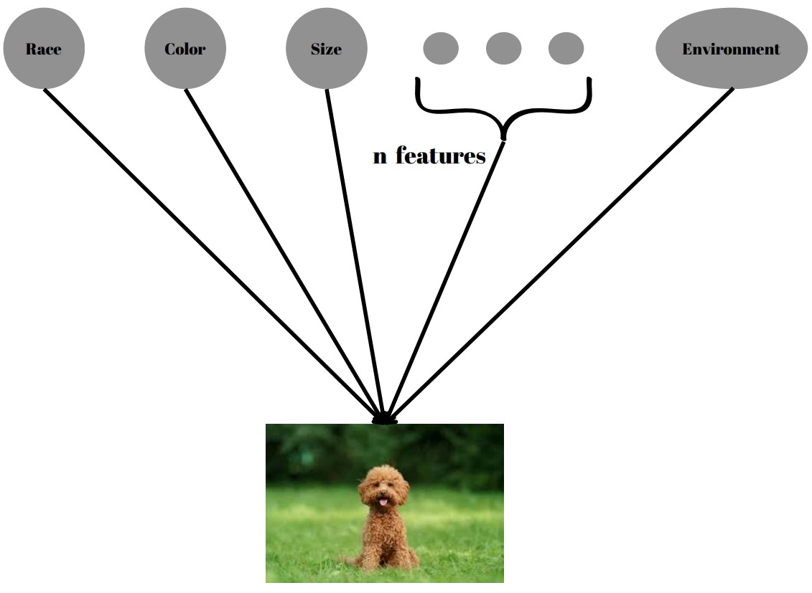
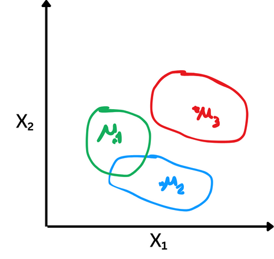
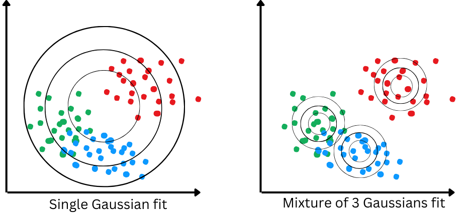

# Latent Variable Models & Variational Inference
Topic Summary for CENG796 by Enes Şanlı &amp; Hamza Etcibaşı

## 1. Introduction and Motivation
- **What are Latent Variable Models (LVMs)?**
Latent Variable Models (LVMs) are statistical models that include variables that are not directly observed but are inferred from other variables that are observed (measured). These unobserved variables are termed "latent variables." LVMs are used to model complex phenomena where the observed data is believed to be generated from underlying factors that are not directly measurable.

Like in Fig 1. suppose we want to generate an image of a dog. We know that dogs have certain features, such as color, breed, and size. However, can we limit these features? Or can we identify every feature for each image? The answer to this question is, of course, no. A single image can have an infinite number of latent features, and it is impossible for us to identify all of them accurately. However, if we can learn the most important of these features, we can use them to generate images much more easily. This is because estimating probability distributions based on an image's features is much easier than estimating from a complete probability distribution. This logic is the motivation behind Latent Variable Models.

- **Importance and Applications in Machine Learning and Statistics**
- **Motivation Behind Using Latent Variable Models**
  
## 2. Mixture Models
#### 2.1 Mixture of Gaussians: A Shallow Latent Variable Model

The Mixture of Gaussians (MoG) model is a probabilistic model that assumes data points are generated from a mixture of several Gaussian distributions. Each Gaussian distribution represents a cluster or component within the overall data distribution. This model is often used for clustering and density estimation.

In a Mixture of Gaussians model, we have a latent variable \(z\) that determines which Gaussian component a data point belongs to. The generative process can be represented as a simple Bayesian network: z → x 

Here:
- \(z\) is the latent variable.
- \(x\) is the observed data.

  

#### Generative Process

1. **Select a Gaussian component:**
   - Sample **z** from a categorical distribution with **k** components.
   

        $z \sim \text{Categorical}(1, \ldots, k)$
   

2. **Generate a data point:**
   - Given **z = k**, sample **x** from the corresponding Gaussian distribution.
   

        $p(x \mid z = k) = \mathcal{N}(x \mid \mu_k, \Sigma_k)$
   

When training a Mixture of Gaussians model, we start with like a single Gaussian fit. As training progresses, assuming the distribution isn't too complex and we have a good estimate for the number of clusters, the model performs effective clustering. Similar points end up with similar z estimates, resulting in soft clustering. This approach is also useful in unsupervised learning. The approach is illustrated in Fig 3. below:

  

By following these steps, the Mixture of Gaussians model generates data points that can represent complex, multimodal distributions through the combination of multiple Gaussian components.

- **Use Cases and Advantages of MoG in Modeling Data Distributions**

The Mixture of Gaussians (MoG) model is a versatile and powerful tool in various data analysis tasks. Here are some key use cases and advantages of using MoG:

#### **_Use Cases:_**

1. **Clustering:** MoG is commonly used for clustering data into groups. Each Gaussian component can be seen as representing a cluster, allowing for effective identification of subpopulations within the data.
   
2. **Density Estimation:** It is useful for estimating the probability density function of a dataset, especially when the data distribution is complex and multimodal (having multiple peaks).

3. **Anomaly Detection:** By modeling the normal data distribution with MoG, points that fall in low-probability regions can be identified as anomalies or outliers.

4. **Image Segmentation:** In image processing, MoG can be used to segment images by clustering pixels based on color or intensity values.

#### **_Advantages:_**

1. **Flexibility:** MoG can model a wide range of data distributions by combining multiple Gaussian components, making it suitable for complex datasets.

2. **Soft Clustering:** Unlike hard clustering methods, MoG provides soft clustering where each data point has a probability of belonging to each cluster, offering more nuanced insights.

3. **Scalability:** MoG can be scaled to handle large datasets and high-dimensional data, making it practical for real-world applications.

4. **Interpretability:** The parameters of the Gaussian components (mean and covariance) provide meaningful information about the data structure, aiding interpretability.

5. **Probabilistic Framework:** Being a probabilistic model, MoG allows for uncertainty quantification and principled statistical inference.

By leveraging these advantages, the Mixture of Gaussians model is a powerful tool for understanding and analyzing complex data distributions. **However**, the Mixture of Gaussians model has its limitations. It can be sensitive to initialization, making it prone to local optima. Determining the optimal number of components is challenging, and the model assumes Gaussian distributions, which may not always fit the data accurately. Additionally, computational complexity increases with data dimensionality, and overfitting can occur. Despite these challenges, the model remains valuable for understanding complex data distributions.
  
#### 2.2 Variational Autoencoders (VAEs)
- **VAEs as a Generative Model**

While the Gaussian distribution may seem simple on its own, the combination of multiple Gaussians can introduce complexity. Consider a scenario where we possess latent factors indicating whether a data point belongs to a certain Gaussian. In such cases, the conditional distribution given these latent factors, denoted as $p(x|k)$, becomes much simpler compared to the original distribution $p(x)$. Although the original distribution might be complex, given the latent factor of each data point, the conditional distribution needed to fit that latent factor would be comparatively simpler. However, since we lack knowledge of these latent factors, the challenge lies in discovering them concurrently while learning these conditional distributions.

Our aim is to arrive at a robust marginal distribution of $x$ that effectively explains the data. We can express this as:

    $$p(x) = \sum_{z} p(x, z) = \sum_{z} p(z) p(x \mid z) = \sum_{k=1}^{K} p(z = k) \mathcal{N}(x; \mu_k, \Sigma_k)$$

However, instead of employing a fixed number of Gaussian distributions ($K$), we aspire to utilize neural networks to create more expressive models resembling a mixture of an infinite number of Gaussians.

We can represent this using neural networks as follows:
Let the latent variable $z$ be drawn from a standard Gaussian distribution: $z \sim \mathcal{N}(0, I)$.
We define the conditional distribution of $x$ given $z$ using neural networks: $p(x | z) = \mathcal{N}(\mu_{\theta}(z), \Sigma_{\theta}(z))$, where $\mu_{\theta}$ and $\Sigma_{\theta}$ are neural networks parameterized by $\theta$.

This formulation enables us to model complex relationships within the data by learning the parameters of the neural networks $\mu_{\theta}$ and $\Sigma_{\theta}$, allowing for a flexible and adaptive representation of the underlying data distribution.
  
- **Difference Between Deterministic and Stochastic Latent Representations**
  
__In deterministic latent representations__, each input is mapped to a single, fixed latent representation. This mapping is entirely deterministic, meaning that given the same input and model parameters, the resulting latent representation will always be the same. We can think of it as a straightforward one-to-one mapping where each input corresponds to a specific encoded representation.
  

    $$ z = f(x) $$

Here, $z$ represents the deterministic latent representation, and $f(x)$ denotes the deterministic mapping function from input $x$ to latent representation $z$.

Deterministic latent representations are commonly employed in traditional autoencoders and similar models. While they provide a simple and deterministic way to encode information, they may struggle to capture the inherent variability and uncertainty present in real-world data.

In contrast, __stochastic latent representations__ introduce randomness or stochasticity into the mapping from input to latent representation. Rather than producing a single fixed value, the mapping generates a probability distribution over possible latent representations. This distribution captures the uncertainty and variability inherent in the data, allowing for more flexible and expressive representations.

    $$ z \sim p(z \mid x) $$

Here, $z$ represents the stochastic latent representation sampled from the distribution $p(z \mid x)$, which is conditioned on the input data $x$.

**Variational Autoencoders (VAEs)** are a prime example of models that leverage stochastic latent representations. In VAEs, the encoder network outputs the parameters of a probability distribution (e.g., mean and variance) instead of a fixed value. The latent representation is then sampled from this distribution, introducing randomness into the encoding process.

  
## 3. Inference and Marginal Probability
#### 3.1 Marginal Likelihood
- **Importance of Marginal Likelihood in Variational Probabilistic Modeling**

#### 3.2 Sampling Techniques
- **Overview of Monte Carlo Methods for Estimating Marginal Probabilities:**
  - Naive Monte Carlo
  - Importance Sampling

#### 3.3 Evidence Lower Bound (ELBO)
- **Introduction to ELBO as an Objective Function in VAEs**
- **ELBO’s Role in Variational Inference and Model Training**
  
## 4. Learning Latent Variable Models
#### 4.1 Stochastic Variational Inference (SVI)

# Learning via Stochastic Variational Inference (SVI)

Stochastic Variational Inference (SVI) is a technique used to optimize a probability distribution $P$ over some latent variables given observed data $D$. Let's break down of how it works:

## Optimization Objective

The goal is to optimize the likelihood function $L(x_i; \theta, \phi_i)$ as a function of model parameters $\theta$ and variational parameters $\phi_1, ..., \phi_M$. We use stochastic gradient descent to achieve this optimization.

## Likelihood Function

The likelihood function is defined as:

$$L(x_i; \theta, \phi_i) = \sum_{z} q(z; \phi_i) \log p(z, x_i; \theta) + H(q(z; \phi_i))$$

where $q(z; \phi_i)$ is the variational distribution over latent variables $z$, $p(z, x_i; \theta)$ is the joint distribution of latent variables and observed data, and $H(q(z; \phi_i))$ is the entropy of the variational distribution.

## Optimization Steps

1. **Initialization**: Initialize model parameters $\theta$ and variational parameters $\phi_1, ..., \phi_M$.
2. **Sampling**: Randomly sample a data point $x_i$ from the dataset $D$.
3. **Variational Inference**: Optimize $L(x_i; \theta, \phi_i)$ with respect to $\phi_i$ using gradient ascent until convergence.
4. **Update Model Parameters**: Compute the gradient of $L(x_i; \theta, \phi_i^*)$ with respect to $\theta$ and update $\theta$ in the gradient direction.
5. **Repeat**: Repeat steps 2-4 until convergence.

## Gradients Computation

- **Gradient with respect to $\theta$**: Compute the gradient using Monte Carlo sampling to estimate the expectation.
- **Gradient with respect to $\phi$**: This is more complex as the expectation depends on $\phi$. We still use Monte Carlo sampling for estimation, but with a trick called **the reparametrization trick**.

## Key Assumption

The variational distribution $q(z; \phi)$ is tractable, meaning it's easy to sample from and evaluate.

This approach allows us to learn latent variable models efficiently by iteratively optimizing model parameters and variational parameters using stochastic gradient descent.

## 4.2 Reparameterization Trick

The reparameterization trick is a clever technique used in stochastic variational inference to compute gradients with respect to the parameters $\phi$ when dealing with continuous latent variables. Let's break down how it works:

### Gradient Computation Objective

We aim to compute the gradient with respect to $\phi$ of the expectation:

$\mathbb{E}_{z \sim q(z; \phi)} [r(z)] = \int q(z; \phi) \, r(z) \, dz$

where $z$ is continuous and follows a Gaussian distribution $\mathcal{N}(\mu, \sigma^2 I)$ with parameters $\phi = (\mu, \sigma)$.

### Equivalence in Sampling
Let's assume $q(z; \phi) = \mathcal{N}(\mu, \sigma^2 I)$ is Gaussian with parameters $\phi = (\mu, \sigma)$. Using the equivalance, we can:
- Sample $z$ directly from $q_{\phi}(z)$.
- **or equivalently** Sample $\epsilon$ from $\mathcal{N}(0, I)$ and transforming it into $z = \mu + \sigma \epsilon = g(\epsilon; \phi)$.

So, we compute the expectation by integrating over $\epsilon$ after transforming into $z$ using $g(\epsilon; \phi)$.

### Gradient Estimation

Using the reparameterization trick, we can compute the gradient with respect to $\phi$ as follows:
- Compute the gradient of the expectation with respect to $\phi$ by applying the chain rule.
- Utilize Monte Carlo sampling to estimate the gradient if $r$ and $g$ are differentiable with respect to $\phi$ and $\epsilon$ is easy to sample from.

### Practical Implementation

In our context of learning latent variable models, where the expectation depends on both $z$ and $\phi$, we can still employ the reparameterization trick by assuming $z = \mu + \sigma \epsilon = g(\epsilon; \phi)$. Then, we estimate the expectation as a Monte Carlo average over samples of $\epsilon$.

This technique enables efficient computation of gradients with respect to the variational parameters $\phi$, facilitating the optimization of latent variable models.

#### 4.3 Amortized Inference
- **Introduction to Amortization Techniques for Efficient Inference in VAEs**
  
## 5. Autoencoder Perspective
#### 5.1 Comparing VAE with Traditional Autoencoders
- **Contrast Between VAEs and Standard Autoencoders in Representation Learning**
- **Advantages of VAEs in Generating Diverse and Meaningful Samples**
  
## 6. Conclusion
- **Summary of Key Concepts Covered in the Discussion of Latent Variable Models**
- **Pros and Cons of Latent Variable Models**
- **Future Directions and Challenges in the Field of Latent Variable Modeling**
